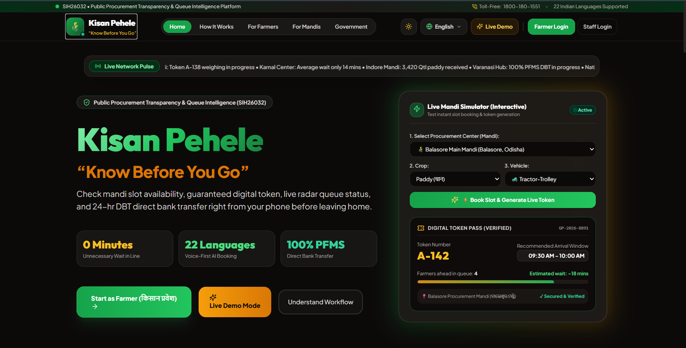

# Kisan Pehle

A multilingual, farmer-first procurement transparency and queue intelligence platform designed to help farmers plan better before visiting mandis, while giving officers and administrators real-time operational visibility.



## Overview                                         -

Kisan Pehele helps farmers avoid wasted trips, long waits, and uncertainty at procurement centers. The platform combines live mandi status, queue estimates, booking flow, digital token tracking, and transparent payment visibility into one user-friendly experience.

This project is built for the SIH 2023 problem statement on public procurement transparency and queue intelligence, focusing on:

- Farmer arrival planning
- Real-time mandi and queue visibility
- Digital token issuance and tracking
- Officer and admin operational management
- Auditability and accountability
- Multilingual access for diverse farmer communities

## Why it matters

Farmers often travel long distances without knowing whether a center is open, how crowded it is, or whether their crop will be accepted. Kisan Pehele brings clarity to the process by surfacing the right information before the trip begins.

The experience is designed around the idea of:

> “Pehle pata, phir mandi.”
>
> “Know before you go.”

## Core features

### For farmers
- Live mandi status and queue tracking
- Slot booking and token generation
- Recommended arrival windows
- Estimated wait times
- Crop inspection and quality transparency
- Digital token access and progress updates
- Support for trusted helpers and multilingual experience

### For procurement centers and officers
- Queue management and token updates
- Arrival registration and verification workflows
- Crop inspection data capture
- Procurement progression status monitoring
- Operational controls for center capacity and flow

### For administrators and auditors
- Dashboards with procurement analytics
- Real-time metrics and centre utilization views
- Compliance and audit trail visibility
- Decision support for smarter public procurement management

## Tech stack

- Frontend: React + Vite + TypeScript
- Backend: NestJS + TypeScript
- Database: Prisma + SQLite/PostgreSQL-ready schema
- Real-time updates: WebSockets
- Styling: Tailwind CSS
- Architecture: Modular monorepo workspace

## Project structure

```text
KisanPehle/
├── apps/
│   ├── api/
│   └── web/
├── docs/
├── infrastructure/
├── packages/
│   └── shared-types/
├── docker-compose.yml
├── package.json
├── README.md
└── ...
```

## Quick start

1. Install dependencies:

   ```bash
   npm install
   ```

2. Start the API:

   ```bash
   npm run dev:api
   ```

3. Start the web app:

   ```bash
   npm run dev:web
   ```

4. Open the application in the browser and explore the farmer, officer, admin, and auditor journeys.

## Documentation

Additional product and system details are available in:

- [docs/ARCHITECTURE.md](docs/ARCHITECTURE.md)
- [docs/DEMO_WALKTHROUGH.md](docs/DEMO_WALKTHROUGH.md)

## Goals and impact

Kisan Pehele aims to improve transparency, reduce farmer uncertainty, streamline procurement operations, and build trust in public agricultural systems through better digital coordination.

## License

This project is licensed under the MIT License.

## Contact

For project collaboration or questions, connect with the Kisan Pehele engineering team.
