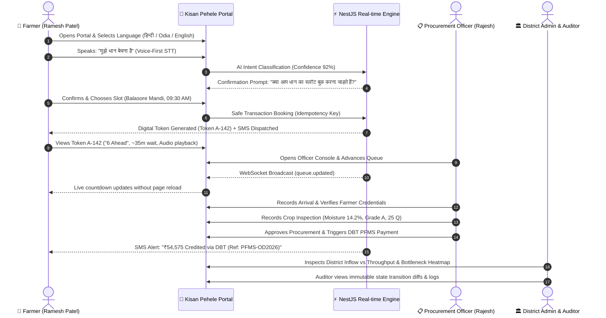

# Kisan Pehele — 15-Step End-to-End Demo Walkthrough Guide

**Product Tagline:** *“Pehle pata, phir mandi.”* (“Know before you go.”)  
**Product Philosophy:** *“Kisan Pehele”* (Farmer First) — Putting farmer time, accessibility, dignity, and transparency first.  
**SIH Problem Statement:** SIH26032 — Farmer Procurement Transparency & Queue Intelligence Platform

---

## 🌾 End-to-End Continuous Demonstration Storyline

This continuous narrative demonstrates how **Kisan Pehele** connects the farmer's journey with government procurement operations in real time.

---

## 🎬 Step-by-Step Demonstration Steps

### Step 1: Open Farmer Experience (`/farmer`)
- Navigate to `http://localhost:5173/farmer`.
- Observe the clean, trustworthy public-service visual design (calm greens, high-contrast typography, large touch targets, zero flashy glassmorphism).

### Step 2: Multilingual Language Selection (22 Indian Languages)
- Tap the **Language** button in the header.
- Switch between **हिन्दी (Hindi)**, **ଓଡ଼ିଆ (Odia)**, **বাংলা (Bengali)**, **ਪੰਜਾਬੀ (Punjabi)**, **मराठी (Marathi)**, and **English**.
- Notice all titles, cards, buttons, badges, and audio prompts immediately translate without hardcoded strings.

### Step 3: Voice-First AI Assistant (STT & TTS)
- Tap the **🎤 बोलकर पूछें (Voice Assistant)** button.
- Speak or tap the prompt: *“मुझे धान बेचना है”*.
- Notice the AI intent parser accurately identifies `intent: BOOK_CROP` and `crop: धान / Paddy` with 92% confidence.
- **AI Safety Rule**: The system requests human confirmation before performing any booking.
- Tap **“हां, आगे बढ़ें (Confirm)”** $\to$ Navigates smoothly to the slot booking wizard.

### Step 4 & 5: Procurement Center Discovery & Live Capacity (`/farmer/centers`)
- View nearby procurement centers with live distance (e.g. 5.2 km away), active weighing counters (3 counters), current queue size, estimated wait time, operating hours, and capacity indicators.
- Notice the **Smart Alternative Mandi Recommendation**: When a center is crowded, the platform recommends a faster alternative mandi.

### Step 6 & 7: Safe Slot Booking & Digital Token Generation (`/farmer/book-slot`)
- Select **Paddy (Dhan)** $\to$ Enter **25 Quintals** $\to$ Select **Balasore Main APMC Mandi** $\to$ Choose time slot **09:30 AM - 09:50 AM** $\to$ Select **Tractor Trolley (`OD-01-AB-1234`)**.
- Tap **“टोकन जारी करें (Confirm & Get Token)”**.
- Confetti triggers, digital token **`A-142`** is generated transactionally with an idempotency key, and audio speech confirmation announces the token.

### Step 8 & 9: Digital Prominent Token & Offline Access (`/farmer/token`)
- Observe the prominent ticket card showing **`A-142`**, recommended arrival (**09:15 AM**), **6 farmers ahead in queue**, and estimated wait time (**~35 mins**).
- Tap the **“ऑडियो में सुनें (Listen Audio)”** button to hear the complete details read aloud in rural-friendly cadence.
- **Offline test**: If internet connectivity disconnects, the token remains immediately visible from local offline storage.

### Step 10 & 11: Real-time Officer Queue Controller (`/officer`)
- In a side-by-side browser window, switch role to **📋 खरीद अधिकारी (Officer Console)**.
- Tap **“अगला टोकन बुलाएं (Call Next in Queue)”**.
- Observe the farmer window update in real-time via WebSockets without page refresh.

### Step 12: Verification, Crop Inspection & DBT Payment
- In the Officer Console:
  1. Tap **“आगमन दर्ज (Mark Arrived)”** $\to$ Transition to `ARRIVED`.
  2. Tap **“सत्यापन करें (Verify)”** $\to$ Transition to `INSPECTION`.
  3. Tap **“गुणवत्ता व तौल दर्ज करें (Inspect)”** $\to$ Enter Moisture `14.2%`, Grade `Grade A`, Weighed `25.0 Q` $\to$ Tap **“Accept”** $\to$ Transition to `ACCEPTED` and `PROCUREMENT_COMPLETED`.
  4. Tap **“डीबीटी भुगतान भेजें (Pay DBT)”** $\to$ Generates PFMS DBT payment reference and marks `PAID`.
- Switch back to the Farmer screen (`/farmer/track`) to see the completed timeline and DBT credit confirmation.

### Step 13: District & State Admin Analytics (`/admin`)
- Switch role to **🏛️ प्रशासन (Admin Dashboard)**.
- Review district-level KPIs: Active Centers (4/4), Total Tokens (142), Average Wait Time (28m), Total Procured (872.5 Q), Total DBT Disbursed (₹19.04 Lakhs).
- View live charts: Hourly Inflow vs Completed Throughput, Center Capacity Utilization, Crop Distribution.
- Tap **“रिपोर्ट डाउनलोड (Export)”** to export an audit-ready operational JSON/CSV report.

### Step 14: Immutable Compliance Audit Trail (`/auditor`)
- Switch role to **🔍 ऑडिटर (Auditor Portal)**.
- Inspect the chronological audit logs showing actor ID, role (`OFFICER`, `FARMER`, `ADMIN`), action, entity, previous state $\to$ new state JSON diff, IP address, and timestamp.

### Step 15: Basic-Phone Keypad IVR & SMS Simulator (`/simulator`)
- Switch to **☎️ IVR / SMS Simulator**.
- Tap the green **“कॉल लगाएं (Call)”** button on the virtual feature phone.
- Press **1 for Hindi** $\to$ Press **1 for Token Status**.
- The simulated IVR voice immediately queries the database and speaks: *“नमस्ते रमेश पटेल जी, आपका टोकन A-142 है। बालासोर मंडी में आपके आगे 6 किसान हैं। अनुमानित प्रतीक्षा समय 35 मिनट है।”*
- Review the automated SMS Dispatch Log showing all transactional alerts.
